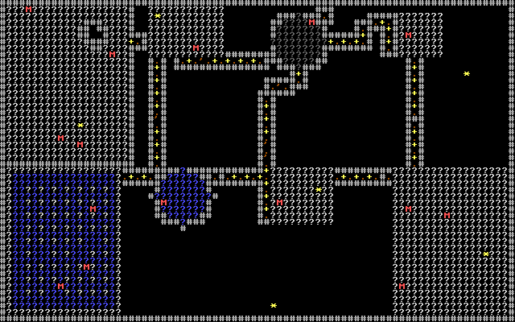

# Incursion Port to Jai

A port of [Incursion: Halls of the Goblin King](https://github.com/rmtew/incursion-roguelike) from C++ to the [Jai programming language](https://en.wikipedia.org/wiki/Jai_(programming_language)).

## Why?

Incursion is an ambitious roguelike implementing the d20 SRD (D&D 3.5 rules) with deep tactical combat. The original codebase has accumulated significant technical debt:

- **modaccent** - A parser generator built on ACCENT/Gentle that produces 1980's-style C code, with a bundled C preprocessor also from the 1980's
- **32-bit architecture assumptions** - The code was never designed for 64-bit, causing struct packing issues with modern compilers
- **Vendored dependencies** - All libraries bundled in-repo rather than using modern package management
- **Platform-specific build** - Visual Studio batch scripts with sporadic cross-platform issues

This port reimplements Incursion's resource parsing and game systems in Jai, leaving behind the legacy toolchain entirely.



## Development Approach

This project is developed with [Claude Code](https://github.com/anthropics/claude-code). Jai is in closed beta with no public documentation, so Claude operates under a strict constraint: **no access to official Jai distribution files other than the compiler executable**. Development relies on:

- A reverse-engineered language reference built from public talks and community knowledge
- Compiler error messages as the primary feedback loop
- Iterative refinement when assumptions prove incorrect

This demonstrates that meaningful Jai development is achievable even without official documentation.

## Status

See [`PLAN-MVP.md`](PLAN-MVP.md) for the current roadmap and [`JOURNAL.md`](JOURNAL.md) to follow development progress.

## Building

Requires the Jai compiler (closed beta). Last tested with version `beta 0.2.025`.

```bash
jai src/main.jai
./main.exe
```

## License

This project translates Incursion's game logic and uses its resource scripts. Multiple licenses apply:

- **Upstream Incursion** (BSD/Apache/Expat + OGL) - See [LICENSE-INCURSION](LICENSE-INCURSION)
- **This Jai implementation** (MIT) - See [LICENSE](LICENSE)
